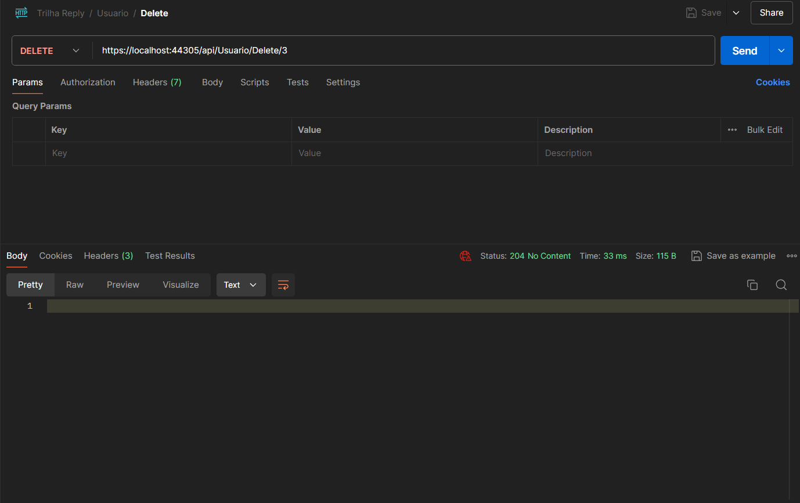

# TrilhaReply

# 📌 Projeto ReplyAPI

Este repositório contém uma API REST utilizando .NET Core 8, Entity
Framework Core (EF Core) Code First e Migrations com SQL Server como banco de dados. Utiliza dos princípios da Injeção de Dependência utilizando interfaces e repositórios para manipular os dados.

## 📋 Requisitos

Softwares necessários para rodar o projeto:

- [.NET SDK 8](https://dotnet.microsoft.com/en-us/download)
- [SQL Server 2022](https://www.microsoft.com/pt-br/sql-server/sql-server-downloads)
- [SQL Server Management Studio (SSMS)](https://aka.ms/ssmsfullsetup) (opcional, mas recomendado)
- [Visual Studio 2022](https://visualstudio.microsoft.com/)
- [Postman](https://www.postman.com/) ou [Swagger UI](https://swagger.io/tools/swagger-ui/) para testar a API

## Após clonar o projeto

### 1️⃣ Configure a Connection String

Abra o arquivo `appsettings.json` e configure a string de conexão com seu SQL Server:

<!-- ```json
"ConnectionStrings": {
    "DefaultConnection": "Server=SQLSERVER2022;Database=ReplyDB;Trusted_Connection=True;TrustServerCertificate=True;"
}
``` -->

<!-- Se estiver usando `localhost`, altere para: -->

```json
"ConnectionStrings": {
    "DefaultConnection": "Server=localhost\\SQLSERVER2022;Database=ReplyDB;Trusted_Connection=True;TrustServerCertificate=True;"
}
```

### 2️⃣ Instalar todas as dependências

```sh
 dotnet restore
```

Foram utilizados os seguintes pacotes/dependências NuGet para realização do projeto que podem ser instalados também por linha de comando individualmente

- [Microsoft.EntityFrameworkCore]
- [Microsoft.EntityFrameworkCore.Design]
- [Microsoft.EntityFrameworkCore.Tools]
- [Microsoft.EntityFrameworkCore.SqlServer]

### 3️⃣ Comandos utilizados ao criar o projeto

```sh
dotnet add package Microsoft.EntityFrameworkCore.Design

Install-Package Microsoft.EntityFrameworkCore.Tools

Install-Package Microsoft.EntityFrameworkCore.SqlServer
```

### 4️⃣ Comandos para Executar as Migrations e Criar o Banco de Dados

instalar dotnet ef

```sh
 dotnet tool install --global dotnet-ef
```

Criar migrations

```sh
 dotnet ef migrations add InitialCreate --project ReplyAPI
```

criar banco de dados e schemas dos modelos

```sh
dotnet ef database update --project ReplyAPI
```

### 5️⃣ Rode a API

### 6️⃣ Teste no Swagger

```
 https://localhost:44305/swagger/index.html
```

## 🛠 Endpoints Disponíveis

📸 **API rodando no Swagger:**


---

## 🎯 Evidências dos endpoints funcionando

✅ **Endpoints testados no Postman e Swagger:**

Equipe - GetAll


Equipe - Post


Equipe - Put


Equipe - Delete


---

Projeto - GetAll


Projeto - Post


Projeto - Put


Projeto - Delete


---

Tarefa - GetAll


Tarefa - Post


Tarefa - Put


Tarefa - Delete


---

Usuario - GetAll


Usuario - Post


Usuario - Put


Usuario - Delete




---

UsuarioEquipe - GetAll


UsuarioEquipe - Post


UsuarioEquipe - Put


UsuarioEquipe - Delete


